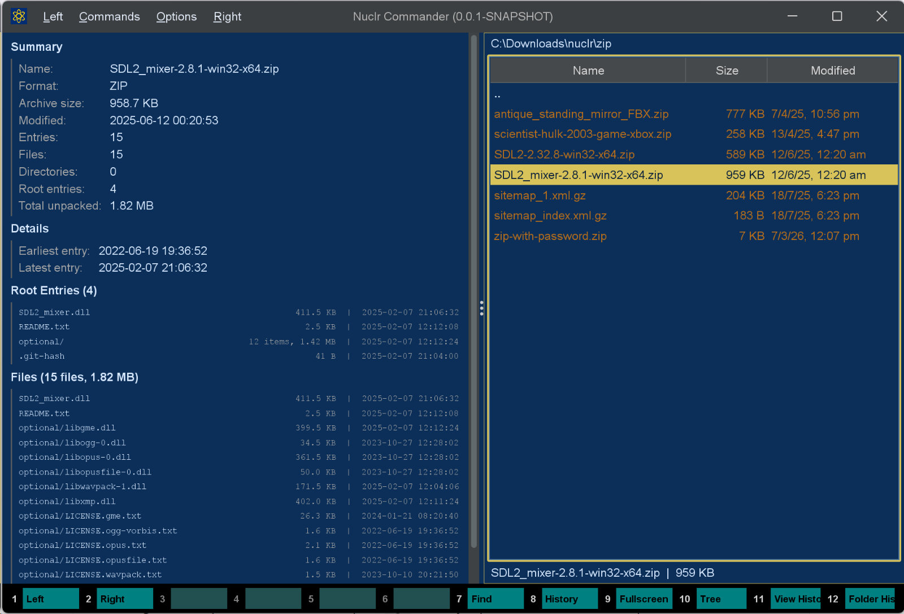

# 🐢📦 Archive Quick Viewer

A [Nuclr Commander](https://nuclr.dev) plugin that renders a read-only quick preview for common archive formats. It does not extract files or mount the archive. Instead, it shows the generally available metadata you usually want at a glance: file counts, total sizes, root entries, timestamps, and a bounded file listing. Slow and steady, but for archives. 🐢



---

## 👀 What It Shows

| Section | Details |
|---|---|
| **Summary** | Archive name, detected format, archive size, modified time, entry/file/directory counts, root entry count |
| **Totals** | Total unpacked size and, where available, packed size and compression ratio |
| **Details** | Earliest and latest entry timestamps, archive comment when present |
| **Root Entries** | Top-level files/folders with descendant counts, aggregate size, and latest timestamp |
| **Warnings** | Encryption flags, multi-volume hints, truncated lists, or metadata limits |
| **Files** | A bounded listing of archive members with path, size, and timestamp when available |

---

## 🧰 Supported Formats

| Format | Extensions |
|---|---|
| ZIP family | `zip`, `jar`, `war`, `ear`, `apk`, `xapk`, `apks`, `apkm` |
| TAR | `tar`, `tar.gz`, `tgz`, `tar.bz2`, `tbz2`, `tbz`, `tar.xz`, `txz` |
| Single-file compressed | `gz`, `bz2`, `xz` |
| 7-Zip | `7z` |
| RAR | `rar` |
| CPIO | `cpio` |
| Unix AR | `ar` |

Some formats expose more metadata than others. For example, packed sizes are usually available for ZIP/RAR entries but not for all stream-based archive formats. 🐢

---

## ✨ Design Notes

- **Read-only preview**: no extraction, mutation, or external tools
- **Cancellation-aware**: switching files cancels the in-flight parse
- **Asynchronous loading**: parsing runs off the Swing EDT on a virtual thread
- **Bounded UI output**: the file list is capped so very large archives do not flood the quick-view panel
- **Best-effort metadata**: timestamps, comments, compression totals, and encryption flags are shown when the underlying format exposes them

---

## 📥 Installation

Copy the signed plugin archive and detached signature into the Nuclr Commander `plugins/` directory:

```text
quick-view-archive-<version>.zip
quick-view-archive-<version>.zip.sig
```

Nuclr Commander verifies the RSA-SHA256 signature against `nuclr-cert.pem` on load. The plugin becomes available immediately without a restart.

---

## 🗂️ Source Layout

```text
src/main/java/dev/nuclr/plugin/core/quick/viewer/
├── ArchiveQuickViewProvider.java   plugin entry point
├── ArchiveViewPanel.java           Swing UI renderer
└── archive/
    ├── ArchiveParser.java          format detection and metadata extraction
    ├── ArchiveMetadata.java        parsed archive summary model
    ├── ArchiveEntryInfo.java       individual file entry model
    └── ArchiveRootInfo.java        top-level aggregate model
```

---

## ⚙️ Implementation Notes

- ZIP-family archives are read with Apache Commons Compress `ZipFile` 📦
- TAR and compressed TAR variants are inspected as streams 🌊
- 7z support uses Commons Compress plus `org.tukaani:xz` 7️⃣
- RAR support uses `junrar` 🧩
- Single-file compressed formats such as plain `.gz` can only expose limited metadata compared with container formats like `.zip` or `.tar.gz` 📝

---

## 📚 Dependencies

| Library | Version | Purpose |
|---|---|---|
| `dev.nuclr:platform-sdk` | `3.0.1` | Nuclr platform interfaces |
| `commons-compress` | `1.28.0` | ZIP, TAR, 7z, GZ, BZ2, XZ, CPIO, AR parsing |
| `junrar` | `7.5.8` | RAR archive parsing |
| `xz` | `1.11` | XZ decompression support |

---

## 📄 License

Apache License 2.0. See [LICENSE](LICENSE).
